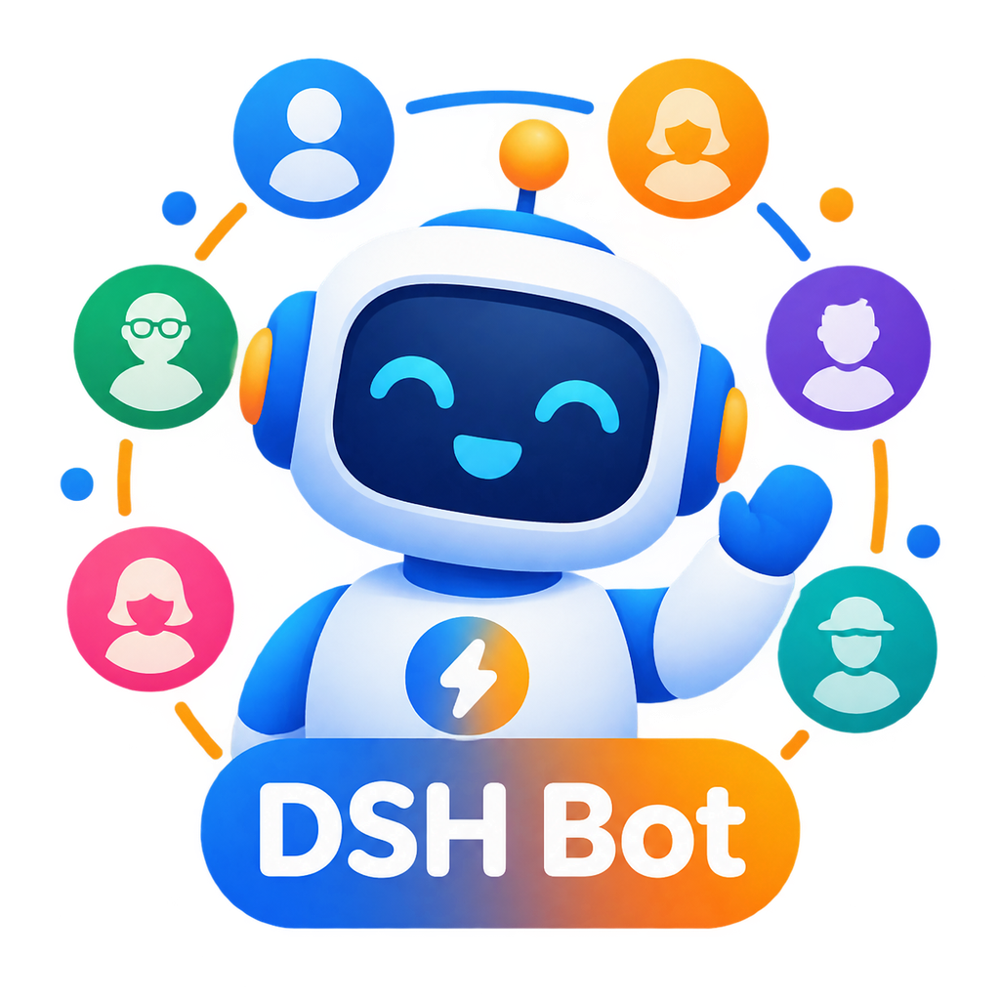
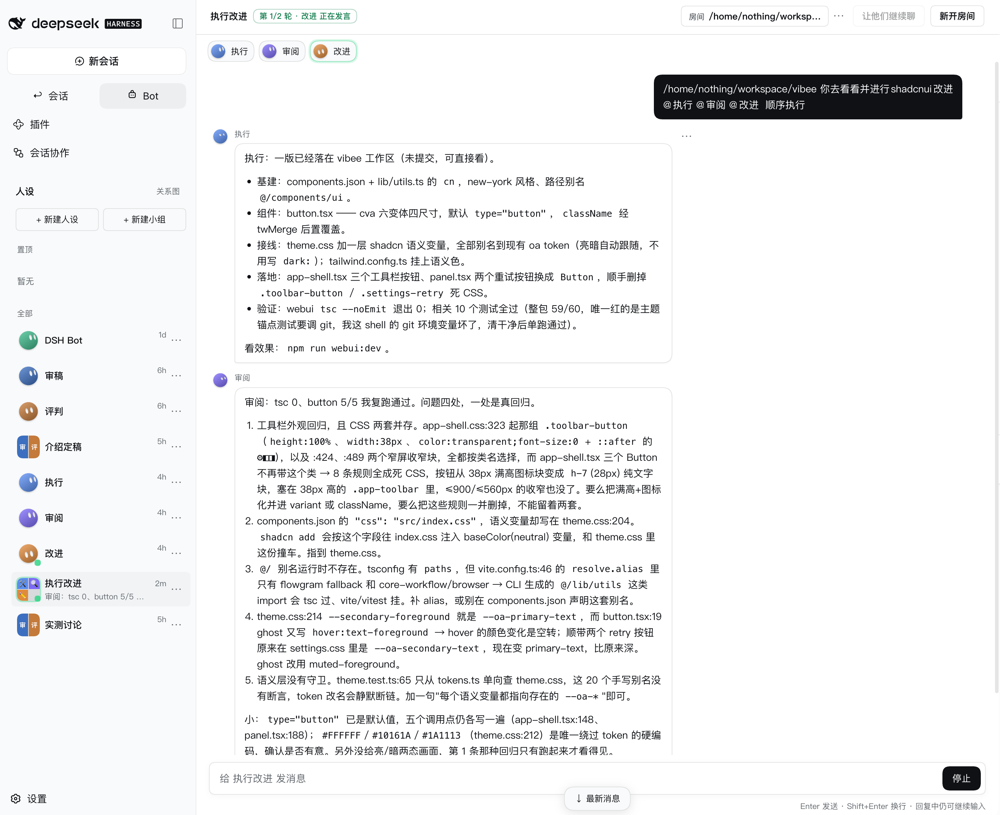

<p align="center">
  
</p>

<h1 align="center">DSH Bot</h1>

<p align="center">
  <strong>为 DeepSeek Shell 提供常驻对话能力的插件</strong>
</p>

<p align="center">
  管理多个 AI 人设，让它们独立对话或小组协作，构建属于你的 AI 助理团队。
</p>

---

## 为什么需要 DSH Bot

DeepSeek Shell 本身提供强大的 agent 能力，但缺少「常驻助理」的概念。DSH Bot 填补了这个空白：

- **始终在线** - 不用每次重新创建会话，助理一直在那里等你
- **多人设管理** - 为不同场景创建专门的助理（工作、生活、技术、创意...）
- **团队协作** - 让多个助理在小组中讨论同一个问题，获得多角度视角
- **跨会话记忆** - 助理记住你们之间的对话，形成长期的工作关系
- **程序化调用** - 其他 agent 可以通过 `dsh_bot_ask` 委托 bot 处理任务

## 核心功能

<p align="center">
  
  <br>
  <em>工作台界面：左侧管理多个人设，右侧进行对话</em>
</p>

### 人设管理

在工作台左侧创建和管理多个 AI 助理，每个都有独立的：
- 人设描述（决定对话风格和专业领域）
- 头像标识（emoji 或首字母色块）
- 专属模型配置（可选，否则跟随全局设置）
- 跨会话记忆（自动积累对话历史中的重要信息）

人设分组管理：**置顶**、**工作**、**生活** 三个默认组，可拖拽移动。

### 1:1 私聊

点击某个人设进入专属对话界面：
- 所有对话历史都在这个人设下
- 右上角切换该人设的不同会话主题
- 消息右键「📌 记住这条」添加到长期记忆
- 会话头点击「🧠」查看和管理记忆内容

### 小组讨论

创建 2-6 人的小组，让多个人设协作讨论：

```
你：我们应该用 React 还是 Vue 做这个项目？

[第一轮]
前端工程师：从技术栈成熟度看，React 生态更丰富...
架构师：考虑团队熟悉度和长期维护成本...
项目经理：建议先做原型验证，两周内决定...

[第二轮]
前端工程师：@项目经理 原型可以用 Vite 快速搭建...
架构师：同意，技术选型应该基于实际验证...
```

**讨论机制：**
- 默认 3 轮讨论（可在小组设置中调整）
- 支持 `@` 点名特定成员
- 引用某成员的消息时，该成员优先回应
- 讨论进行中发送的新消息会自动排队
- 点击「让他们继续聊」可以不发新消息让讨论继续

### 定时例程

为任何 bot 设置定时任务：
- 每天特定时间（支持时区设置）
- 每小时整点
- 自定义间隔（分钟）
- 高级 cron 表达式

到点后 bot 在专门的「例程 · 名称」线程里自动执行，没事干就回复 `(silent)`，有事才落消息。窗口失焦时会触发系统通知。

### Bot 间通信

Bot 可以通过 `dsh_bot_send({toBot, text})` 工具给其他 bot 发消息：
- 发件人立刻收到 `{accepted: true}` 确认
- 收件人在「来自 <发件人名>」会话中处理
- 每 bot 每分钟限 3 条，防止消息轰炸
- 工作台「同事」页查看发送记录

### 委托工具

任何 DSH agent 都可以通过 `dsh_bot_ask` 委托 bot 处理任务：

```javascript
// 在任何 agent 中调用
const result = await dsh_bot_ask({
  message: "帮我分析这段代码的性能瓶颈",
  context: codeSnippet
});
```

委托创建的会话默认隐藏（标题带 `~` 前缀），工作台需开启「包含隐藏」才显示。

## 快速开始

### 安装和启动

```bash
# 安装依赖
pnpm install

# 构建项目
pnpm run build

# 设置环境（第一次或配置变更后）
sh env/setup.sh

# 启动服务
sh env/boot.sh
```

启动后访问：
- **主页**：http://127.0.0.1:3084
- **工作台**：http://127.0.0.1:3084/dsh-bot/ui

也可以在 DSH 官方 GUI 顶栏点击「Bot」进入工作台。

### 运行测试

```bash
# 完整测试（包含模型调用）
bash scripts/manual-test.sh

# 只测配置和会话创建（不调用模型）
bash scripts/manual-test.sh --no-write
```

测试覆盖：会话创建、委托工具、模型配置、标记查询、工作台 CRUD 操作。

## 配置

### 模型设置

Bot 默认使用 DSH 全局模型配置。如需为 bot 指定专属模型，在 settings 中配置：

```yaml
dsh-bot:
  model:
    provider: deepseek
    model: deepseek-chat
    reasoningEffort: high  # 可选
```

留空则完全跟随全局配置。配置变更热生效，无需重启服务。

### 记忆系统

默认启用自动记忆抽取。关闭方法：

```yaml
dsh-bot:
  memory:
    enabled: false
```

记忆存储在 `$DSH_HOME/dsh-bot/memory/<botId>/`：
- `profile.md` - 长期事实
- `log.jsonl` - 时间线日志

## 项目架构

```
dsh-bot/
├── packages/
│   ├── tool-dsh-bot/        # 委托工具定义
│   ├── ui-dsh-bot/          # 官方 GUI 集成
│   ├── dsh-bot-host/        # 主服务：RPC、SSE、路由
│   ├── workbench-ui/        # 工作台前端（React）
│   └── dsh-bot-shared/      # 共享类型和工具
├── env/                     # 独立的 DSH_HOME
│   ├── dsh-bot/            # bot 注册表、小组、记忆
│   └── session-tool/       # 会话标记
├── scripts/
│   └── manual-test.sh      # 集成测试
├── standards/               # 社区标准对齐
└── docs/                    # 设计文档
```

## 开发指南

### 本地开发

```bash
# 类型检查
pnpm run typecheck

# 运行单元测试
pnpm test

# 监视模式
pnpm test:watch

# 社区标准检查
pnpm run standard:check
```

### 调试

使用 `dsh-plugin-debug` skill 查看内部状态：

```bash
# 确认服务身份
~/.agents/skills/dsh-plugin-debug/scripts/dsh-rpc-who.sh 3084

# 查看插件列表
~/.agents/skills/dsh-plugin-debug/scripts/dsh-rpc.sh 3084 pluginInventory/list
```

### 查询会话标记

```bash
DSH_HOME="$PWD/env" node ../../session-tool/plugin/packages/session-tool-cli/lib/bin.js marks list --mark app:dsh-bot
```

## 技术说明

### 会话管理

使用 [session-tool](https://github.com/Nothing1024/session-tool) 管理会话，标记为 `app:dsh-bot`（过渡期双写 `kind:dsh-bot`）。

### 工作台实时更新

通过 Server-Sent Events (SSE) 推送更新：
- 私聊：SSE 连接后停止轮询
- 小组：每 5 秒拉取房间状态（识别成员变更）
- 断线时降级为 2 秒轮询
- 标签页隐藏时暂停（节省资源）

### 小组讨论机制

成员发言通过隐藏会话实现：
- 标题格式：`~dsh-bot-group:<roomId>-<memberId>`
- 标记为 `kind:hidden`，默认不在工作台显示
- 口吻在 write 时注入，不修改 bot 配置
- 不归档（避免 DSH 0.2.0-rc.1 的归档会话限制）

### 边界和限制

**人设编辑**：只对新会话生效。创建会话时快照人设，已有对话保持原口吻。

**委托会话**：`dsh_bot_ask` 创建的会话默认隐藏，需在工作台开启「包含隐藏」才能看到。

**排队持久化**：小组讨论的排队消息只在内存中，重启服务会丢失。

**官方会话**：在 DSH GUI 用「+ 新会话」创建的会话不归 DSH Bot 管理。

## 社区标准

本项目对齐 [dsh-community-standard](https://github.com/oh-my-dsh/dsh-community-standard) v0.15：

- `packages/tool-dsh-bot/dsh-plugin.json` - 工具插件 manifest
- `packages/ui-dsh-bot/dsh-plugin.json` - UI 插件 manifest  
- `standards/host-descriptor.json` - Host 能力声明
- `standards/` - 纯函数协商、fixtures、适配器基线

详见 [standards/README.md](standards/README.md)。

## 品牌资源

`brand/` 目录包含项目视觉资产：

| 文件 | 用途 |
|------|------|
| `logo-primary.png` | 主 logo，适合应用图标、文档封面 |
| `icon-simple.png` | 简化图标 (512×512)，适合 favicon |
| `banner-horizontal.png` | 横向 banner (1536×512)，适合 GitHub 头图 |
| `screenshot-workbench.png` | 工作台截图，用于文档演示 |

**配色规范：**
- 主色：蓝色渐变 `#2196F3` → `#1976D2`
- 辅助色：橙色渐变 `#FF9800` → `#F57C00`
- 设计风格：圆润友好、扁平化、渐变质感

## 文档

- [环境配置详解](env/README.md)
- [任务包索引](docs/README.md)
- [归档材料](docs/archive/README.md)
- [v1 设计文档](docs/archive/dsh-bot-mvp/)
- [工作台设计](docs/archive/dsh-bot-workbench/)

## 许可

本项目为私有仓库，未明确授权不得复制或分发。

---

<p align="center">
  基于 <a href="https://github.com/oh-my-dsh/deepseek-shell">DeepSeek Shell</a> v0.2.0-rc.1
</p>
